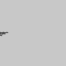
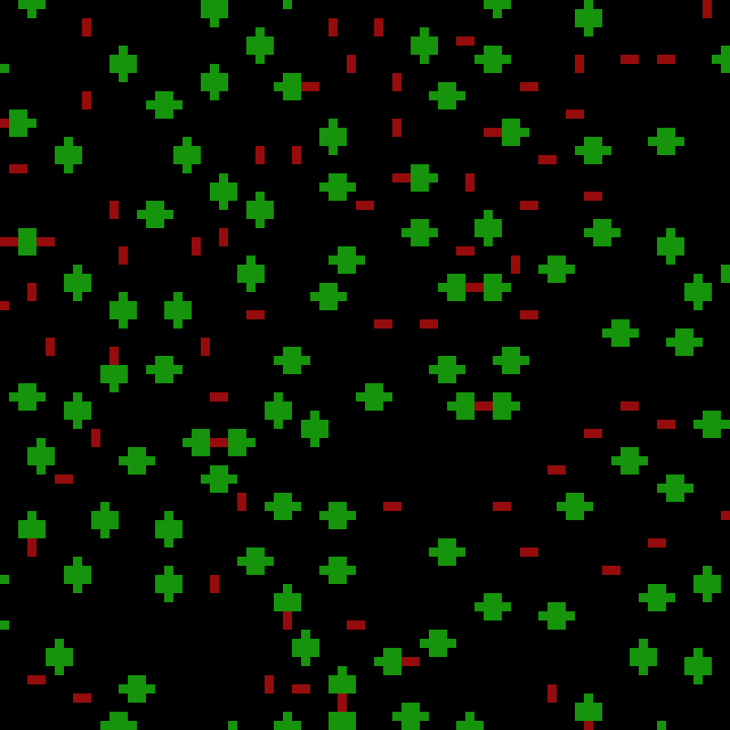
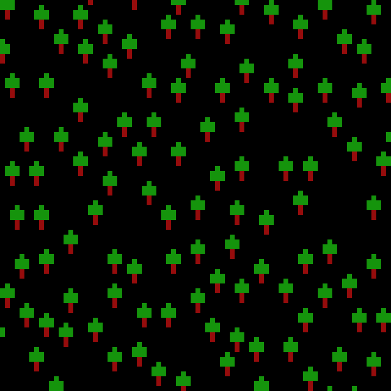
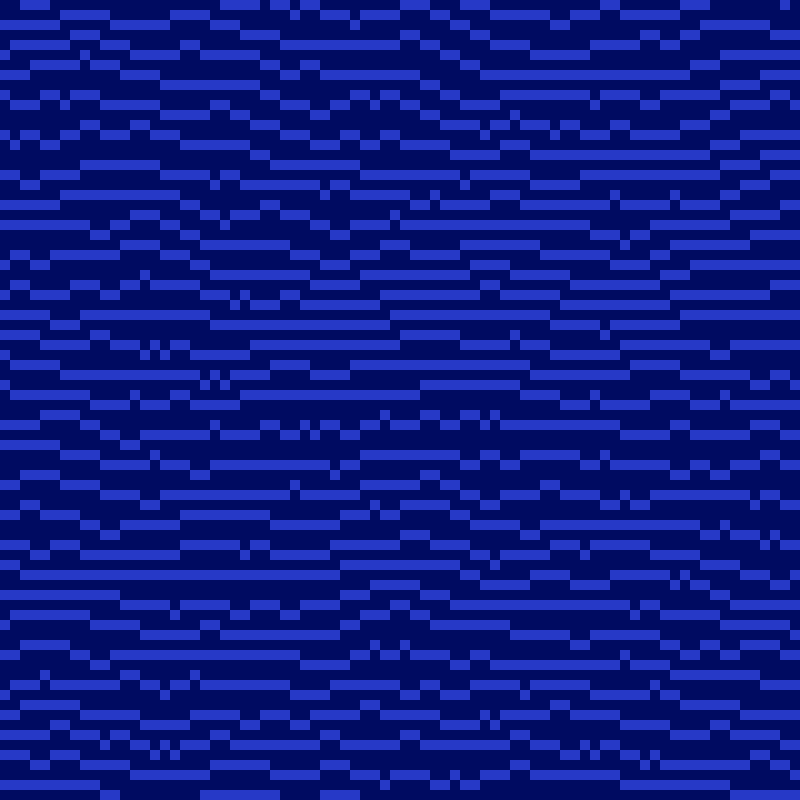
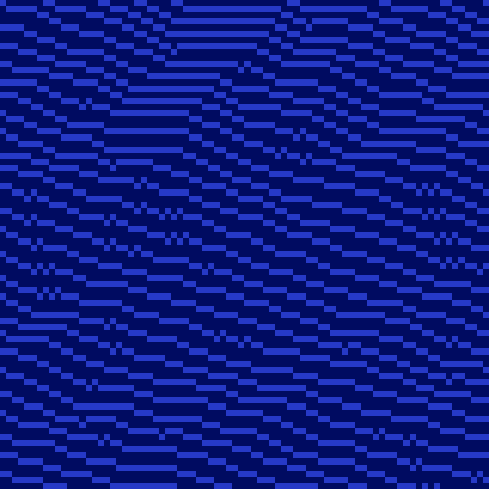

# WaveFunctionCollapse in C++

This repository contains several C++ implementations of the Wave Function Collapse (WFC) algorithm, developed as a university project by Mordelia and Sanstitr.

The project is based on the original WFC repository by mxgmn:

- https://github.com/mxgmn/WaveFunctionCollapse

The goal was to implement the algorithm in C++, then parallelize it using OpenMP tasks or Kokkos.

The animation below was recorded with the OpenMP GIF version on one of the bundled samples, with enough frames to make the collapse process easy to follow.

<p align="center">
	
</p>

## What is included

- `sequential/`: a standalone sequential C++ implementation.
- `openmp/`: an OpenMP task-based parallel version.
- `openmp_gif/`: an OpenMP version that also records a GIF of the collapse process.
- `kokkos/`: a Kokkos-based implementation with multiple backends.
- `samples/`: a few small input images you can use right away.

Each implementation uses the vendored `stb_image.h` and `stb_image_write.h` headers, so there is no external image library dependency.

## Visual examples

These renders were generated with the sequential implementation using the samples shipped with the repository. They show how the result changes when tile symmetries are enabled or disabled.

| Sample | Symmetries on | Symmetries off |
| --- | --- | --- |
| Forest |  |  |
| Water |  |  |

## Requirements

For the sequential and OpenMP versions, you need:

- A C++17 compiler such as `g++` or `clang++`
- `make`
- OpenMP support for the OpenMP variants

For the Kokkos version, you also need:

- A working Kokkos installation
- Either `pkg-config` support for Kokkos or a `KOKKOS_PREFIX` pointing to the install directory
- A supported backend, selected with `BACKEND`

On Debian or Ubuntu, the basic tools are usually available with:

```bash
sudo apt install build-essential make pkg-config
```

Then install Kokkos through your package manager or your own build if you want to use the `kokkos/` directory.

## Build and run

### Sequential version

```bash
cd sequential
make
./wfc
```

The default run uses a built-in 5x5 sample. To use one of the provided images:

```bash
./wfc ../samples/forest.png 128 128 3 32 1
```

Arguments:

```text
wfc [image] [outW] [outH] [N] [scale] [useSymmetries]
```

- `image`: input image path, optional
- `outW`, `outH`: output size in cells
- `N`: tile size
- `scale`: pixel size used when writing `output.png`
- `useSymmetries`: `1` to enable tile symmetries, `0` or `--no-symmetry` to disable them

Generated files:

- `output.png`

### OpenMP version

```bash
cd openmp
make
./wfc_openmp
```

Example:

```bash
./wfc_openmp ../samples/water.png 128 128 3 32 1
```

Arguments:

```text
wfc_openmp [image] [outW] [outH] [N] [scale] [useSymmetries]
```

This variant uses OpenMP tasks to parallelize tile extraction and constraint propagation.

Generated files:

- `output.png`

### OpenMP GIF version

```bash
cd openmp_gif
make
./wfc_openmp_gif
```

Example:

```bash
./wfc_openmp_gif ../samples/wall.png 96 96 3 16 120 1
```

Arguments:

```text
wfc_openmp_gif [image] [outW] [outH] [N] [scale] [maxGifFrames] [useSymmetries]
```

Notes:

- `maxGifFrames` controls how many frames are captured for the GIF.
- `useSymmetries` works the same way as in the other variants.
- The program writes both `output.png` and `output.gif`.

Generated files:

- `output.png`
- `output.gif`

### Kokkos version

The Kokkos project supports several backends through the `BACKEND` variable:

- `openmp` default
- `cpu`
- `cuda`
- `hip`

Build with the default backend:

```bash
cd kokkos
make
./build/openmp/wfc_kokkos
```

Build another backend:

```bash
make BACKEND=cpu
make BACKEND=cuda
make BACKEND=hip
make BACKEND=openmp
```

Example run:

```bash
./build/openmp/wfc_kokkos ../samples/forest.png 128 128 3 32 1
```

Arguments:

```text
wfc_kokkos [image] [outW] [outH] [N] [scale] [useSymmetries]
```

If Kokkos is not found automatically, you can point the build to your installation with:

```bash
make KOKKOS_PREFIX=/path/to/kokkos
```

or rely on `pkg-config` if your installation exposes `kokkos.pc`.

Generated files:

- `build/<backend>/wfc_kokkos`
- `output.png`

## Cleaning up

Each subproject has its own clean target:

```bash
make clean
make clean-output
```

For Kokkos:

```bash
make clean
```

The repository-level `.gitignore` already excludes the generated images, build directories, object files, dependency files, and local binaries.

## Project notes

- The sequential implementation is the reference version.
- The OpenMP implementations parallelize the algorithm with tasks.
- The Kokkos version is structured so it can be built for several execution backends.
- All variants preserve the same core idea: extract overlapping tiles from a sample image, compute compatibility constraints, and collapse a target grid until it forms a new image.

## Credits

- Original Wave Function Collapse concept and repository: mxgmn
- Coursework implementation and parallelization: Mordelia and Sanstitr
